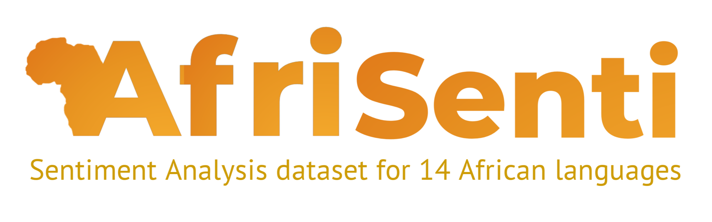

# AfriSenti-SemEval-2023

This repository contains code for the SemEval 2023 Shared Task 12: Sentiment Analysis in African Languages (AfriSenti-SemEval). More information can be found at the: [shared task](https://afrisenti-semeval.github.io/) and [competition](https://codalab.lisn.upsaclay.fr/competitions/7320) websites.

